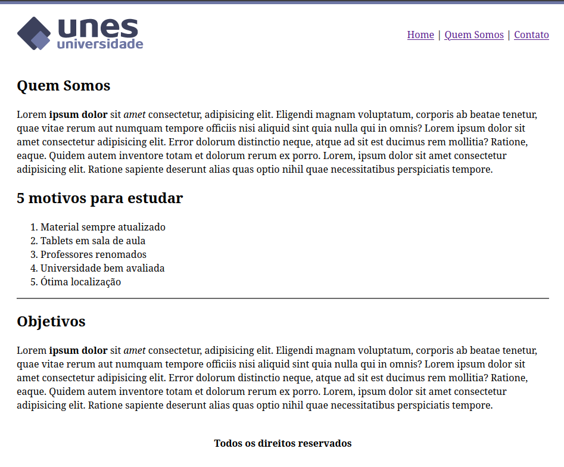
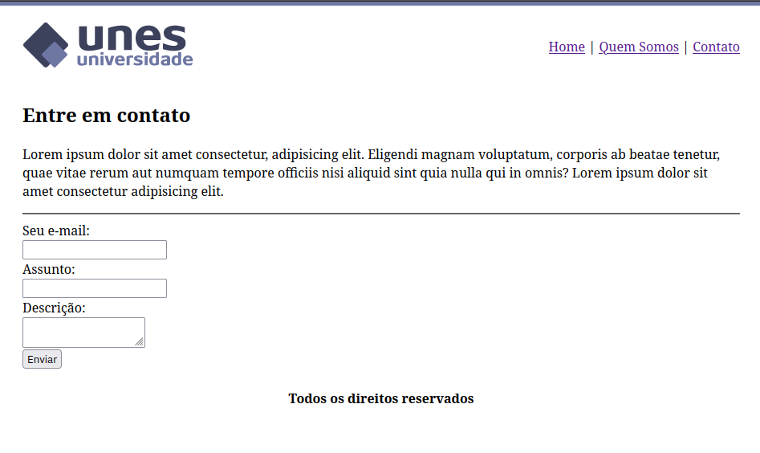

<h1 align="center">
   Unes Universidade
</h1>

## 💻 Projeto

Um site simples para gestão e apresentação de informações da Universidade, desenvolvido como parte do curso "Desenvolvimento Web Completo - 20 cursos + 20 projetos" da Udemy.

## 🚀 Tecnologias

Esse projeto foi desenvolvido com as seguintes tecnologias:
- HTML

## 📷 Demonstração

